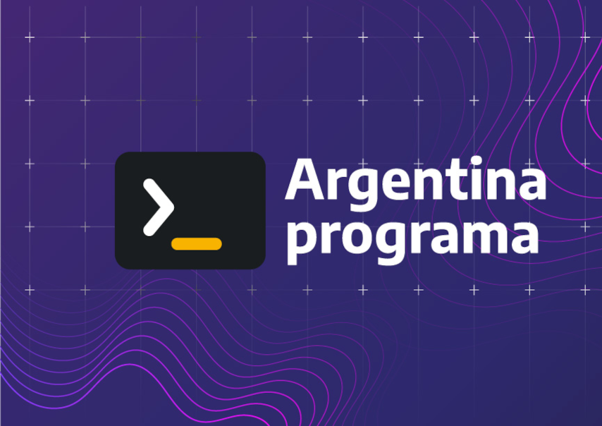
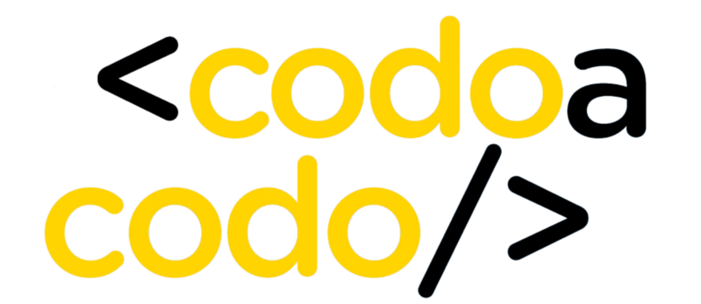

### Hola 👋, Mi nombre es ***Iván Latorre***
#### desde el 2022 empezando a full con la programación.
***
**Estudiante de programación iniciando en:** :muscle::muscle::muscle:

- **INFORMATORIO (2022)**

    
- **Arg Programa (2022)**
    
    
- **CODO A CODO (2023)**
    
    
***    
~~~
Habilidades en Desarrollo: / HTML / CSS / JS / PYTHON / DJANGO / JAVA / SPRINGBOOT 
~~~
***
- 🔭 Estoy realizando futuros proyectos. 
***
**CONTACTO**

        

***